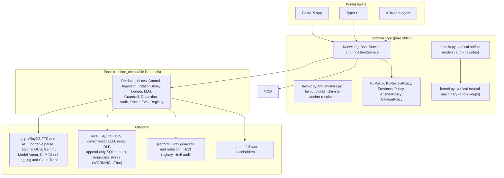
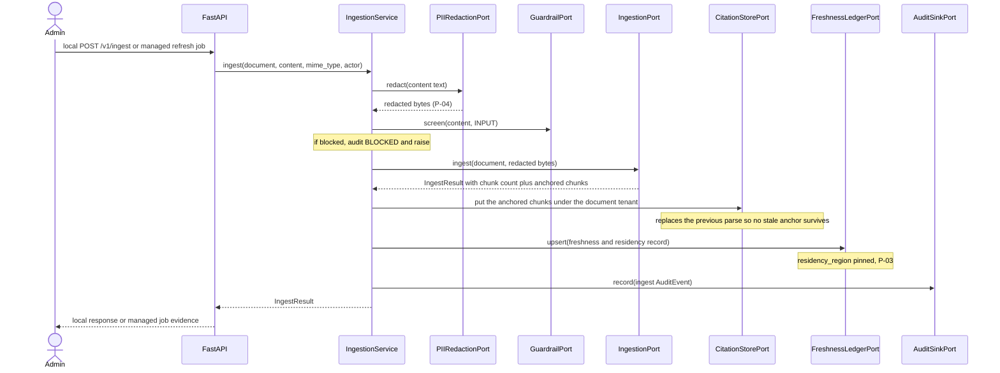
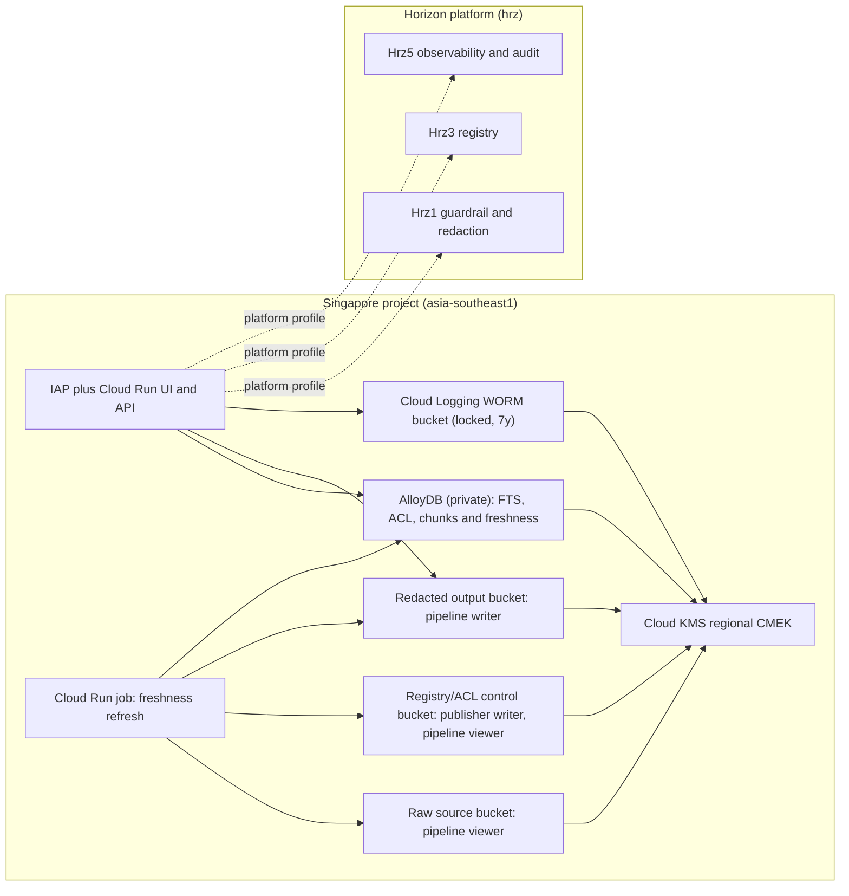

# Architecture : Hrz2 Enterprise Knowledge Base

> **Authority:** SPEC > ARCHITECTURE > COMPLIANCE > README > `docs/`. See [`docs/doc-authority.md`](docs/doc-authority.md).

Hrz2 is a hexagonal (ports-and-adapters) service. The domain core is pure standard library;
every external concern (retrieval, access control, ingest, LLM, guardrail, audit) is a
`Protocol` port with four adapter families: `gcp` (managed, lazy SDK), `local` (SDK-free,
a WORKING offline laptop stack), `platform` (httpx clients to sibling services), and
`onprem` (fail-fast SDK-free placeholders). This document shows the two request flows, the
ingest flow, and the deployment topology.

## 0. Ports and their adapters

| Port | gcp | local | platform | onprem |
| --- | --- | --- | --- | --- |
| `IdentityPort` | IAP assertion verify | seeded dev personas | IAP assertion verify | fail-fast |
| `RetrievalPort` | AlloyDB PostgreSQL FTS | SQLite FTS5 | | fail-fast |
| `AccessControlPort` | tenant-scoped AlloyDB bindings provisioned from IAM | in-process directory | | fail-fast |
| `IngestionPort` | portable parse + regional GCS | same parse + FTS5 | | fail-fast |
| `CitationStorePort` | AlloyDB chunk table | SQLite `document_chunks` | | fail-fast |
| `FreshnessLedgerPort` | AlloyDB | SQLite | | fail-fast |
| `LLMPort` | Gemini | deterministic generator | | fail-fast |
| `GroundingPort` | google_search | disabled | | benign default |
| `GuardrailPort` | Model Armor | heuristic | Hrz1 remote | fail-fast |
| `PIIRedactionPort` | DLP | regex | Hrz1 remote | fail-fast |
| `AuditSinkPort` | Cloud Logging WORM | append-only SQLite | Hrz5 remote | fail-fast |
| `ObservabilityTracerPort` | Cloud Trace | no-op | | no-op |
| `EvaluationGatePort` | deterministic offline eval gate | offline eval gate | | fail-fast |
| `AgentRegistryPort` | reserved, not advertised until trusted runtime context exists | in-process | Hrz3 remote | fail-fast |
| `ToolCatalogPort` | MCP catalog | in-process | | fail-fast |
| `AgentRuntimePort` / `SessionPort` / `MemoryPort` | disabled pending trusted invocation context | in-process | | fail-fast |

The AlloyDB adapters share one SDK-free connection-input boundary and enable connector IAM
database authentication. Terraform creates distinct IAM database users for the app and pipeline
service accounts; the deployment injects only that workload's Terraform-output
username as `KB_ALLOYDB_USER`, while Application Default Credentials are exchanged for a
short-lived database token. Managed readiness validates the URI and workload username before
serving. The protected, VPC-reachable `schema-migration.yaml` workflow runs
`scripts/apply_managed_schema.sh` under the dedicated schema-owner IAM identity and retains
migration hashes/preflight/grant evidence: the serving user receives only `USAGE` and `SELECT`, the pipeline receives scoped DML,
and `PUBLIC` receives no table access or schema creation. The migration creates and owns the ACL,
chunk/citation and freshness tables; adapters perform operations only and never issue DDL.
Because the app IAM DB user is read-only, managed `POST /v1/ingest` and document deletion refuse;
the scheduled/administrative pipeline is the only managed writer. Local keeps the routes for the
SDK-free demo.

The default `local` path imports no google-cloud package. Under `local`, the
platform-client ports (to Hrz1/Hrz3/Hrz5) use in-process implementations, not HTTP to siblings.

## 1. Layering



The `Container` (`config.py`) binds each port to one adapter per active `KB_PROFILE`,
reading the dotted paths in `config/settings.yaml`. Adapters are built lazily, so the
`local` and `onprem` profiles import the whole package with no Google Cloud SDK installed.

### 1.1 Kernel vs vertical inside the domain

The domain is split along the fork boundary, and the direction of the arrow above is the
whole point:

| | `domain/kernel.py` | `domain/models.py` |
| --- | --- | --- |
| Holds | Provenance (`Citation`, `WebCitation`), the LLM envelope (`LlmRequest`, `LlmResponse`, `TokenUsage`, `ThinkingLevel`), safety verdicts (`GuardrailVerdict`, `RedactionResult`), the maker-checker scale (`ReviewLevel`, `ReviewOutcome`), the audit record (`AuditEvent`, `Decision`) and the eval report | Documents, chunks, ACL tags and principals, `KbQuery`, `RetrievedPassage`, freshness records, the agent card, and `GroundedAnswer` |
| A fork that retargets the vertical | keeps it byte-for-byte | rewrites it |
| Imports | nothing from `enterprise_kb` | the kernel, and only in that direction |

`models.py` re-exports every kernel name, so `from enterprise_kb.domain.models import
Citation` is unchanged and no call site had to move when the boundary was drawn.
`tests/contract/test_kernel_boundary.py` asserts the split structurally: the kernel
imports nothing from this package, every declared kernel export is re-exported by
`models` as the SAME object (a copy would drift), and no vertical type has leaked into
the shared half.

Two kernel names are re-exported rather than declared: `StrEnum` and, since the
observability harmonisation, `TokenUsage`, both from the shared `hex-service-kit`. `TokenUsage`
was three `int` fields defaulting to zero, and every repo in the catalog carried an identical
copy of exactly that, which is how copies drift. The class body is gone; the name, the fields
and every call site are unchanged, and `tests/contract/test_port_parity.py` asserts object
identity with the commons class so a future copy fails loudly. The same applies to
`ObservabilityTracerPort`, which `ports/observability.py` now re-exports instead of restating.
The server-verified `Principal`, `RequestContext`, `IdentityError` and safe `ANONYMOUS` value are
likewise re-exported from `hex-service-kit`; that shared `Principal` owns the narrow-only
`entitlement_principals` rule. The same contract suite asserts object identity, so Hrz2 cannot
quietly restore a behaviorally drifting copy.
`EvaluationGatePort` is deliberately declared here because its result is Hrz2's domain
`EvalReport`. `agent-eval-kit` remains a dev-only command and mutation-test scaffold. The serving
port is a structural Protocol and imports none of that package; a subprocess contract test blocks
`agent_eval_kit` while importing the full serving app to keep the packaging boundary executable.

The bank-owned numbers live in a third module, `domain/policy.py`: `KbPolicy` is parsed
once from the `policy:` settings section and hands each engine the narrow policy it needs
through a `from_policy` constructor, so no engine reads settings and no threshold is a
module constant.

## 2. Search and answer flow

```mermaid
sequenceDiagram
  actor Caller
  participant API as Local API or managed pipeline
  participant IDP as IdentityPort
  participant KB as KnowledgeBaseService
  participant RED as PIIRedactionPort
  participant ACL as AccessControlPort
  participant RET as RetrievalPort
  participant GRD as GuardrailPort
  participant LLM as LLMPort
  participant CIT as CitationStorePort
  participant AUD as AuditSinkPort

  Caller->>API: POST /v1/answer (query, acl_principals)
  API->>IDP: resolve(request headers)
  IDP-->>API: verified Principal (actor + entitlements + tenant) or 401
  Note over API: request body carries no actor and identity is server-verified
  API->>KB: answer(query, actor, entitlement_principals(request), tenant)
  KB->>RED: redact(query)
  RED-->>KB: redacted query (P-04)
  KB->>ACL: resolve(principals)
  ACL-->>KB: allowed tag set (P-09)
  Note over KB: no tags means access denied, audit ESCALATED
  KB->>RET: retrieve(query)
  RET-->>KB: ACL-tagged, tenant-scoped passages
  Note over KB: enforce tenant partition, then subset-match tags, drop untagged
  KB->>GRD: screen(rendered passages, OUTPUT)
  KB->>LLM: generate(passages, structured schema)
  LLM-->>KB: answer plus used_document_ids
  KB->>RED: redact generated answer before anchoring or critique
  RED-->>KB: governed answer text
  Note over KB: map used_document_ids back to retrieved citations and keep the page
  KB->>CIT: get anchored chunks for the document under the verified tenant
  CIT-->>KB: anchored layout chunks or empty for another tenant
  Note over KB: pure resolver picks the block and refines page to anchor plus box
  Note over KB: self-critique; redact/screen caveats; then review policy
  KB->>GRD: screen(answer, OUTPUT)
  KB->>AUD: record(already-redacted AuditEvent)
  KB-->>API: GroundedAnswer (cited, review flag)
  API-->>Caller: 200 AnswerResponse
```

The answer is synthesised only from the permitted, retrieved passages (P-05), citations
keep their provenance (P-07), and a low-confidence or sensitive-classification answer is
flagged for human review (P-06).

Shared corpus ids remain portable business identifiers, while stores key rows by
`(document_id, tenant)`. If a tenant-specific document and a shared document use the same id, the
verified tenant's document shadows the shared copy. Tenant-less tooling drops an ambiguous id.
This keeps the model's id-only citation and subsequent anchor lookup bound to one evidence owner.

**Where the anchor comes from.** The model returns prose and document ids; it never
returns an anchor, a page or a box. `domain/anchors.py` scores each answer sentence
against each stored layout block of the cited document by content-token coverage and takes
the best pair above `policy.citation.anchor_match_floor`. The result is deterministic and
replayable, the anchor can only be a block of the document the citation already names, and
a claim that clears no block leaves the citation untouched at page level. The
`CitationStorePort` read is scoped to the verified tenant, so anchors are subject to the
same isolation as the passages they refine.

## 3. Ingest flow (redact before index)



PII is redacted **before** the document is parsed or indexed, so the governed store never
holds raw PII. A blocked or failed ingest never leaves a half-indexed document.

Parsing is layout-aware and portable across both working profiles: PDF/text extraction runs in
memory through the same parser and yields the same `ParsedDocument` shape, so local demo anchors
have the same form as production. The ingestion adapter parses and the DOMAIN
persists, which is why the citation store is a port the service drives rather than a
second backend every ingestion adapter has to know about.

## 4. Deployment topology (asia-southeast1)



Each managed source allocation is bounded before content enters the process: 1 MiB for the
reviewed registry, 1 MiB for ACL authority and 50 MiB per document. GCS reads verify size and bind
the subsequent byte range to the inspected object generation; HTTP reads stream to the same
document ceiling. CMEK operations are performed by each Google-managed service identity. The app
and pipeline service accounts receive no direct key-use role; Cloud Logging specifically uses the
project Settings API `kmsServiceAccountId`, not an assumed generic Logging identity.

A VPC Service Controls perimeter (`vpc_sc.tf`) wraps the AI/data APIs so data cannot be read
across the boundary to a non-Singapore project, and org policy (`org_policy.tf`) rejects any
resource created outside `asia-southeast1` as a defence-in-depth residency backstop.

## 5. Reversibility and the offline stack

Every port has both a `local` adapter and an `onprem` placeholder, each constructing with a
single `Settings` argument and structurally satisfying the same Protocol as the managed
adapter, proven by `tests/contract/test_port_parity.py` (parametrised over `local` and
`onprem`):

- `local` is a **WORKING** offline stack: the same ports run the whole search / answer /
  ingest pipeline in-process with no Google Cloud SDK, no API key, and no emulator (SQLite
  FTS5 retrieval, a deterministic schema-driven LLM, regex DLP, append-only SQLite audit).
  It backs the dev loop, the unit suite, and CI, and proves the domain runs off-cloud (P-02,
  P-12).
- `onprem` is the **fail-fast** Google Distributed Cloud migration target: every method
  raises `NotImplementedError` and the CLI exits 2 with the migration message. Porting Hrz2 is
  filling in those bodies; the domain core and the service callers do not change.

See `docs/onprem-migration.md`.
