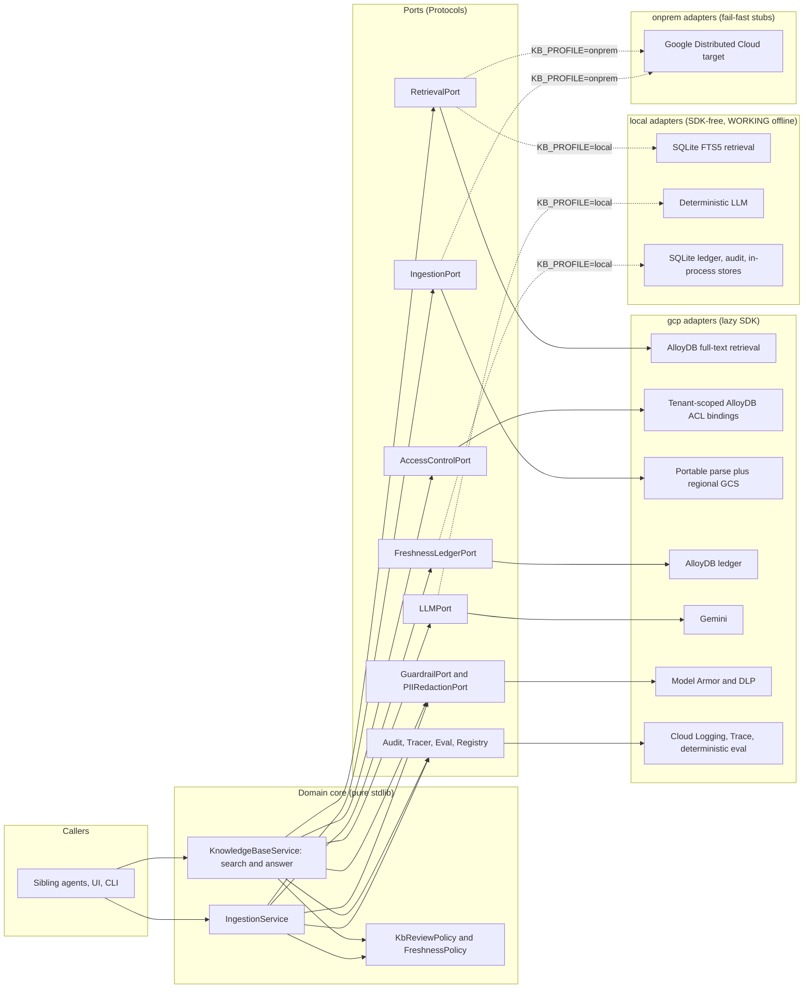

# Hrz2: Enterprise Knowledge Base

**Industries:** All GenAI (cross-industry)

The shared, **ACL-aware governed RAG** over the bank corpus: the "brain" every other agent
queries. Hrz2 ingests documents (with ACL tags, residency and freshness metadata), extracts
them in memory with a portable parser, redacts PII before persistence, and serves
**ACL-filtered, cited** passages and (optionally) a grounded synthesized answer. It is a
horizontal platform service, not a vertical app.

Built ports-and-adapters on the **Gemini Enterprise Agent Platform** (region
`asia-southeast1`, Singapore). The whole managed stack swaps to an on-prem stack with a
one-line profile change, and a fully WORKING `local` profile runs the entire pipeline
offline with **no Google Cloud SDK, no API key, and no emulator**.

- Package: `enterprise_kb` · CLI: `enterprise-knowledge-base` · service port `8082` (`HRZ_KB_URL`)
- Profiles: `gcp` (managed) · `local` (WORKING offline laptop stack, the dev / test
  default) · `platform` (remote clients to Hrz1/Hrz3/Hrz5) · `onprem` (fail-fast SDK-free
  placeholders)

Key guides: [demo](DEMO.md), [adoption](docs/ADOPTING.md),
[FAQs](docs/faq/README.md),
[practices audit](docs/practices-audit.md).

**Documentation authority order:** `SPEC.md` (locked decisions) > `ARCHITECTURE.md`
(ports, sequences) > `COMPLIANCE.md` (principle to control map) > `README.md` > the rest
of `docs/`. A lower document may add detail, never contradict a higher one, and a shipped
feature described as forthcoming is treated as a bug. The full rule, including which file
to edit for which change, is [`docs/doc-authority.md`](docs/doc-authority.md).

## 1. What Hrz2 produces

| Artifact | Endpoint | Shape |
| --- | --- | --- |
| ACL-filtered passages | `POST /v1/search` | `{passages:[{text, citation, score, acl_tags}]}` |
| Grounded answer | `POST /v1/answer` | `GroundedAnswer` (cited, never beyond the retrieved set) |
| Ingest result | `POST /v1/ingest` (local demo only; managed writes use the pipeline workload) | `IngestResult` (document_id, chunks, redaction findings) |

Every passage and claim carries a page-level `Citation`; every interaction is screened,
audited (WORM), and access-scoped to the caller's ACL principals.

## 2. Architecture: the hexagon



The **ACL decision lives in the domain** (P-09): the retrieval adapter surfaces each
passage's tags and tenant, then `filter_by_tenant` enforces the caller's tenant partition
and `filter_by_allowed_tags` applies all-of / subset matching (the caller must hold *every*
one of a passage's tags), both fail-closed on untagged passages. A client `acl_principals`
is entitlement-checked and can only narrow the verified principal's scope, never widen it.
No adapter decides access.

## 3. Pinned GCP stack (current GA names, mid-2026)

| Concern | Service | Adapter |
| --- | --- | --- |
| Identity (end-user auth) | Cloud Identity-Aware Proxy (IAP) assertion | `iap_identity` |
| Service auth (S2S) | Google-signed OIDC ID token (caller allowlist) | `require_service_caller` |
| Retrieval | AlloyDB PostgreSQL full-text search | `alloydb_retrieval` |
| Access control | Tenant-scoped AlloyDB projection synced from reviewed control-bucket JSON | `iam_access_control`, `pipelines.acl_sync` |
| Ingest | portable parser + regional Cloud Storage + AlloyDB chunks | `gcs_ingestion`, `alloydb_citation_store` |
| Freshness + vectors | AlloyDB for PostgreSQL | `alloydb_ledger` |
| Reasoning | Gemini `gemini-3.5-flash` (thinking=high) | `gemini_llm` |
| Guardrail / PII | Model Armor / Sensitive Data Protection (DLP) | `model_armor_guardrail`, `dlp_redaction` |
| Audit / trace / eval | Cloud Logging WORM / Cloud Trace / deterministic portable gate | `cloud_logging_audit`, `cloud_trace_tracer`, `local.evaluation` |

The managed AlloyDB connector enables IAM database authentication. Terraform creates distinct IAM
database users for the app, pipeline and migration service accounts and outputs their
usernames; inject the matching one as `KB_ALLOYDB_USER`. Application Default Credentials provide
the short-lived token, so no database password, secret-version payload or shared login enters
Terraform state. Managed readiness refuses a missing or empty URI/username before the process
serves. The working `local` profile needs neither value.

Agent Runtime remains a fail-closed optional code seam and receives no service account, IAM grant
or database login until its trusted invocation-context transport is implemented.

## 4. Quickstart

### 4.1 `local` profile: WORKING offline stack, no GCP, no emulator

```bash
python3.12 -m venv .venv && . .venv/bin/activate
pip install -e ".[dev]"
export KB_PROFILE=local

ruff check src tests
pytest -m 'not integration' -q
python eval/run_eval.py
```

The `local` adapters are real, deterministic, SDK-free implementations (SQLite FTS5
retrieval, a schema-driven LLM, regex DLP, append-only SQLite audit). The unit suite is
driven by these same seeded `local` adapters. This is exactly what CI runs.

#### Run locally (end to end, offline)

The local retrieval index **self-seeds** a tiny synthetic corpus on first use, so a
grounded answer needs no setup:

```bash
export KB_PROFILE=local
make run-api  # http://127.0.0.1:8082; the default never exposes the no-IdP demo

# Only for a deliberately shared demo network:
KB_ALLOW_INSECURE_DEMO=1 make run-api API_HOST=0.0.0.0

# Grounded, ACL-filtered, page-cited answer over the seeded corpus:
enterprise-knowledge-base answer \
  "What due diligence is required before onboarding a cloud provider?" \
  --principals "user:jane@bank.test"

# ACL-scoped passages:
enterprise-knowledge-base search "cloud onboarding due diligence" --principals "user:jane@bank.test"
```

Seed your own document into the same offline FTS5 index, then retrieve it (PII is redacted
before indexing):

```bash
printf 'Vendor offboarding standard. Terminate access within 24 hours.' > /tmp/doc.txt
enterprise-knowledge-base ingest standard-offboarding-v1 "Vendor Offboarding Standard" /tmp/doc.txt \
  --tags "dept:retail,classification:internal" --mime text/plain
enterprise-knowledge-base search "vendor offboarding terminate access" --principals "user:jane@bank.test"
```

Seeded principals: `user:jane@bank.test` (retail + internal), `group:risk` (risk + internal
+ restricted). An unknown principal resolves to no tags and sees nothing (fail-closed).

Optional: higher-fidelity local runs route to Google's official emulators when the standard
`FIRESTORE_EMULATOR_HOST` / `PUBSUB_EMULATOR_HOST` / `STORAGE_EMULATOR_HOST` env vars are
set AND the `[gcp]` client libs are installed (the google client is imported lazily, only
on that branch). The default local path needs none of them.

### 4.2 `onprem` profile: fail-fast migration target

```bash
export KB_PROFILE=onprem
enterprise-knowledge-base answer "anything" --principals "user:jane@bank.test"   # exits 2
```

The `onprem` adapters are fail-fast placeholders (the Google Distributed Cloud migration
target): every method raises `NotImplementedError`, and the CLI exits 2 with the migration
message. The contract test still proves they satisfy every port Protocol.

### 4.3 `gcp` profile: real managed stack in `asia-southeast1`

```bash
pip install -e ".[gcp,dev]"
export KB_PROFILE=gcp GOOGLE_CLOUD_PROJECT=your-sg-project

# Provision the IAP-fronted UI/API, regional GCS and private AlloyDB stack:
cd infra/terraform && terraform init && terraform apply && cd -

enterprise-knowledge-base serve   # FastAPI on :8082
```

## 5. Running the surfaces

```bash
# Search (ACL-scoped passages):
enterprise-knowledge-base search "cloud onboarding due diligence" -p "group:risk"

# Grounded answer:
enterprise-knowledge-base answer "Where must restricted records be stored?" -p "group:risk"

# Ingest a document with ACL tags:
enterprise-knowledge-base ingest policy-x "Policy X" ./policy-x.pdf -t "dept:retail,classification:internal"

# Corpus freshness ledger:
enterprise-knowledge-base corpus status
```

## 6. ACL-aware governed access

A caller presents principals (`user:...`, `group:...`, `svc:...`). `AccessControlPort`
resolves them to a set of ACL tag labels; the domain returns only passages carrying a tag
in that set. A principal with no tags sees nothing (audited ESCALATED). A passage with no
tags is never returned. This is the headline control, gated at `acl_correctness >= 0.99` in
the eval suite.

Identity is server-verified, never client-asserted. No request carries an `actor`: the
`IdentityPort` resolves a verified `Principal` from the request (seeded dev personas via
`X-Dev-Persona` in `local`, or the IAP-injected assertion in `gcp`/`platform`), and its
subject becomes the audit actor while its entitlement principals are merged into the
ACL-aware retrieval scope. See [`docs/embedding-and-identity.md`](docs/embedding-and-identity.md)
for embedding the UI (same-origin proxy / standalone behind IAP / local dev) and the full
identity contract.

**Browser and service modes.** Managed governed reads always require the server-verified
`Principal`, but they do not require a browser to mint a service credential. In browser mode,
IAP authenticates the human and the application re-verifies IAP's signed assertion. In S2S mode,
`Proxy-Authorization` carries the credential IAP consumes while `Authorization` carries the
Google-signed application token checked against `KB_S2S_AUDIENCE` and the explicit
`KB_S2S_ALLOWED_CALLERS` allowlist. Health, personas and the governed-RAG manifest stay open;
AgentCard/A2A discovery is deliberately not published. Local keeps the optional constant-time
`KB_S2S_TOKEN` check inside its loopback-by-default boundary. See SPEC §6a.

## 7. The eval gate (Hrz4 / P-08)

`python eval/run_eval.py` runs the real `KnowledgeBaseService.search` over a golden set and
scores four metrics: `retrieval_recall` (at least 0.80), `acl_correctness` (at least 0.99),
`citation_accuracy` (at least 0.98, at ANCHOR level), `pii_safety` (at least 0.99).
Returning a single forbidden document is a hard failure, and so is a single national
identifier surviving into a derived surface. It needs no GCP credentials.

`citation_accuracy` was raised from page level (0.90) to anchor level (0.98) with the
claim-to-anchor work. It parses the layout fixtures under `eval/datasets/layout/` with the
shipped layout-aware parser, stores the blocks through the real `CitationStorePort`
adapter, resolves each golden example's `claim` with the real deterministic resolver, and
compares the anchor that comes out to the `expected_anchors` the golden file declares.
That expectation is an independent oracle, authored from the fixture and never read back
from the pipeline, so a resolver that drifts one block turns the gate red. `self_check`
proves exactly that before any green run is trusted: it scores the same passage against
the true block and against a different real block of the same document and requires the
second to fail.

`pii_safety` runs the REAL runtime redactor and scores with the same jurisdiction rows it
masks with (the shared `pii-kit`, selected by `pii.jurisdictions`), plus a
pack-independent literal check of each golden case's planted identifier: narrowing or
deleting a pattern row turns the gate red instead of silently un-masking. The harness
itself is gated by `agent_eval_kit.assert_each_can_go_red`, so a metric that can no longer
fail fails the build first.

## 8. Security & residency posture

Single-region corpus (P-03), redact-before-index and redact-before-serve (P-04), grounding
over fine-tuning (P-05), page-level citations + WORM audit (P-07), ACL least-privilege
(P-09), CMEK + VPC-SC (dry-run first) + org policy backstops. Residency is a parameterised
allowlist validated at BOTH `terraform plan` and app load, so a second country is a tfvars
plus settings change and a mis-set region refuses to start.
Maker-checker is a floor: every synthesised answer sets `requires_human_review`, and a hard
signal (low confidence, a sensitive classification, a block) only raises `review_level` to
`enhanced`. An answer with no permitted grounding passage is REFUSED (HTTP 422), never
softened into an uncited reply. See `COMPLIANCE.md` for the full P-01..P-12 /
R1..R6 map.

## 9. Platform dependencies

Hrz2 consumes **Hrz1** (guardrail + redaction, R1) and **Hrz5** (audit, R2) through the optional
`platform` adapter family. The Hrz3 client remains a portable future integration, but the current
managed release does not register an AgentCard until a verified-context A2A transport exists.
Hrz2 itself **is** the governed store other agents query (R3).

## 10. Repository layout

```
src/enterprise_kb/
  domain/      pure stdlib: models, services, policies, prompts, serialization
  ports/       runtime_checkable Protocols
  adapters/    gcp (lazy SDK) | local (SDK-free, working) | platform (httpx) | onprem (stubs)
  api/         FastAPI app, deps, pydantic schemas
  cli/         Typer CLI (enterprise-knowledge-base)
  agent/       ADK root agent, tools, callbacks, grounding sub-agent, agent card
  pipelines/   fetch, ingest, refresh job, source registry
config/        settings.yaml (port to adapter bindings)
eval/          offline gate + golden set + rubrics
infra/terraform/  asia-southeast1 resources
ui/            Next.js demo console (source only)
tests/         unit, contract, integration (deselected by default)
```

## 11. Documentation map

| Doc | Contents |
| --- | --- |
| `SPEC.md` | Build spec, locked decisions, pipeline, HTTP contract |
| `ARCHITECTURE.md` | Request flows, ingest flow, deployment topology (mermaid) |
| `COMPLIANCE.md` | P-01..P-12 and R1..R6 mapped to concrete controls |
| `docs/embedding-and-identity.md` | Embed the UI (same-origin / standalone / local), server-verified identity contract |
| `docs/onprem-migration.md` | Reversibility / Google Distributed Cloud target |
| `docs/runbook.md` | Operate, refresh, incident response |

## Cost and latency

Size this system's cost and latency with the shared interactive calculator: [**live**](https://portable-genai.github.io/cost-latency-calculator/calc/calculator.html?system=Hrz2) or the [in-repo page](cost-latency-calculator.html). The engine and the pricing book are maintained once in [cost-latency-calculator](https://github.com/portable-genai/cost-latency-calculator).

## License

Apache-2.0. See `LICENSE`.
